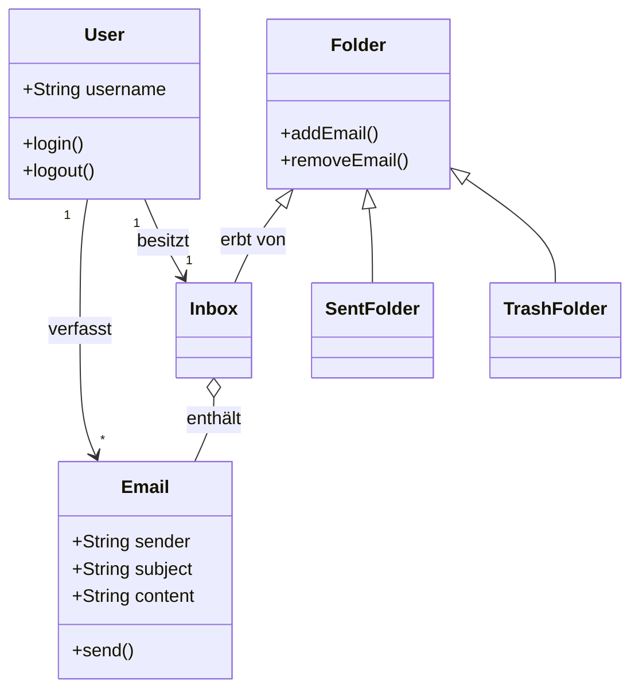

# 📧 Simple Mail System

Dies ist ein **Java-basiertes Projekt**, das ein einfaches **Mail-Verwaltungssystem** simuliert.  
Es wurde im Rahmen meines Studiums entwickelt, um **Objektorientierte Programmierung (OOP)** und die **Trennung von Fachlogik und Benutzeroberfläche (Domain vs. GUI)** zu üben.

---

## ✨ Funktionen
- Benutzer erstellen und verwalten (mit eindeutiger ID)  
- Nachrichten zwischen Benutzern senden und empfangen  
- Posteingang anzeigen und gespeicherte Nachrichten verwalten  
- Fehlermeldungen für unbekannte Empfänger  
- **Grafische Benutzeroberfläche (GUI)** zur einfachen Interaktion mit dem System  

---

## 🛠️ Technologien
- Java (OOP, Klassen, Methoden, Objekte)  
- Java Swing/JavaFX (GUI)  

---

## 🚀 Ausführen
1. Repository klonen oder Dateien herunterladen  
2. Java-Dateien kompilieren:  
   ```bash
   javac *.java

## 📐 UML Klassendiagramm

## 📐 UML Design


